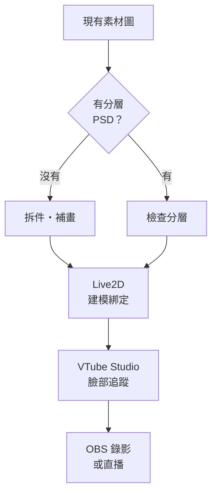

# 從素材圖到 VTuber：Alice 的製作路線

- 更新日期：2026-09-21
- 適用方向：2D Live2D VTuber
- 目標平台：macOS + VTube Studio + OBS

## 先做這個判斷

這張圖採 TD 單線主流程，分支只保留兩個節點，以維持手機版 Obsidian 可閱讀的窄版寬度。

## 建議策略：先驗證，再投入完整版

### 路線 A：快速 MVP（PNGTuber）

適合先確認角色風格、聲音、內容題材，以及自己是否喜歡出鏡／直播。

最低素材：

- 閉嘴、睜眼
- 張嘴、睜眼
- 可選：閉眼版本
- 可選：開心、生氣、驚訝等表情

把圖片放進 PNGTuber 軟體，以麥克風音量切換張嘴／閉嘴狀態，再由 OBS 擷取。這條路不用先完成 Live2D 綁定。

### 路線 B：正式 Live2D VTuber

適合要有轉頭、眨眼、嘴型、頭髮物理、身體晃動與表情切換。

## 第一關：檢查素材圖

若只有一張扁平 PNG／JPG，需要先拆件，而且被遮住的地方必須補畫。舉例：瀏海移動後會露出的額頭、頭轉動後的臉側、嘴巴張開後的口腔，都要存在於各自圖層中。

### 最低建議圖層

- 頭部：臉皮、耳朵、鼻子
- 頭髮：後髮、前髮、左右側髮、獨立髮束
- 眉毛：左、右分開
- 眼睛：左右分開；眼白、虹膜／瞳孔、高光、上眼皮、下眼皮
- 嘴巴：上唇、下唇、口腔、牙齒、舌頭
- 身體：脖子、軀幹、衣服、手臂
- 配件：眼鏡、耳環、髮飾等各自獨立

拆件原則：凡是「想獨立移動」或「移動時會露出底下內容」的地方，都應拆開。

### Live2D PSD 基本規格

依 Live2D 官方文件：

- PSD 格式
- RGB
- 8 bit/channel
- sRGB
- 每個圖層使用不同名稱
- 每個零件的線稿、填色與效果先合併成單一圖層
- 套用圖層遮色片，不保留 layer mask

官方文件：[PSD 匯入](https://docs.live2d.com/en/cubism-editor-manual/psd-import/) · [PSD 製作注意事項](https://docs.live2d.com/en/cubism-editor-manual/precautions-for-psd-data/)

## 第二關：Live2D Cubism 建模與綁定

1. 把 PSD 匯入 Live2D Cubism Editor。
2. 為零件建立 ArtMesh。
3. 建立 Warp Deformer 與 Rotation Deformer。
4. 製作基本參數：
   - 頭部 Angle X／Y／Z
   - Eye Open、Eye Smile、EyeBall X／Y
   - Brow
   - Mouth Open、Mouth Form
   - Body X／Y／Z
5. 加入呼吸、髮絲、衣服與配件物理。
6. 製作表情與快捷動作。
7. 測試各角度是否破圖、穿幫或露出空洞。
8. 建立 texture atlas，匯出 VTube Studio 使用的模型檔。

主要輸出通常包含：

- `.moc3`
- `.model3.json`
- texture `.png`
- `.physics3.json`（若有物理設定）
- 表情／動作檔（若有）

官方文件：[匯出嵌入用模型資料](https://docs.live2d.com/en/cubism-editor-manual/export-moc3-motion3-files/)

## 第三關：VTube Studio 臉部追蹤

1. 在 Mac 安裝 VTube Studio。
2. 將完整模型資料夾匯入。
3. 第一次載入時執行 Auto-Setup。
4. 選擇臉捕：
   - iPhone／iPad：官方排序中追蹤品質最高。
   - Webcam：最省設備，適合先測試。
   - Android：可用，但官方排序在 Webcam 之後。
5. 校正正臉、眼睛與嘴巴。
6. 調整每個輸入值對應 Live2D 參數的靈敏度。
7. 設定表情快捷鍵。

VTube Studio 支援 Windows、macOS、iOS 與 Android；官方建議的追蹤品質排序為 iOS > Webcam > Android。[官方需求說明](https://github.com/DenchiSoft/VTubeStudio/wiki/Introduction-%26-Requirements) · [模型匯入與 Auto-Setup](https://github.com/DenchiSoft/VTubeStudio/wiki/Getting-Started)

## 第四關：OBS 錄影或直播

1. 建立 OBS 場景。
2. 擷取 VTube Studio 畫面並保留透明背景。
3. 加入麥克風、背景、字幕與其他畫面。
4. 先錄一段 3–5 分鐘私人測試。
5. 檢查：
   - 聲音與嘴型是否同步
   - 眨眼是否自然
   - 轉頭是否破圖
   - 頭髮物理是否過度晃動
   - 電腦負載與畫面幀率

VTube Studio 的典型流程是手機或 webcam 追蹤、Mac／PC 顯示模型，再由 OBS 錄製或直播。[官方串流說明](https://github.com/DenchiSoft/VTubeStudio/wiki/Streaming-to-Mac-PC)

## Alice 現在最適合的下一步

上傳現有素材圖，最好同時告訴我：

- 檔案是 PNG、JPG 還是 PSD
- PSD 是否已有分層
- 想做半身還是全身
- 想先快速試播，還是直接做正式 Live2D
- 是否有 iPhone／iPad Face ID 裝置或只用 Mac webcam

收到圖片後，可以直接產出：

1. 素材可用性檢查
2. 圖層拆件清單
3. 建議補畫區域
4. PSD 圖層命名表
5. 第一版製作範圍與驗收清單
